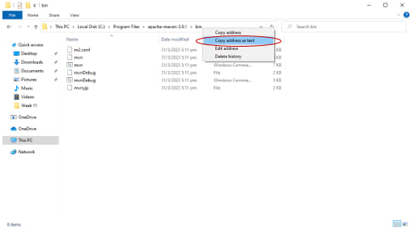

# Form Application System #

Form Application System (FMS) is a data capture web application for Quantum Leap Corporation that aims to simplify the process of onboarding vendors and subcontractors, ensuring that all necessary forms are collected and retained for record-keeping. FMS also allows for approval workflow processing and the ability to visualize which stage of a workflow a vendor is at the moment.

This is the first release of FMS which contains its core functionalities as provided by the sponsor.

## Installation ##
To install FMS, follow these steps:
-   Clone this repository to your local machine.
-   Install Node.js from https://nodejs.org/
-   Follow the installation instructions on your local machine
-   Next, go to https://maven.apache.org/download.cgi
-   Download the binary zip archive

-   Unzip apache-maven-3.9.1.zip
-   Place apache-maven-3.9.1 in a directory of your choosing
-   Copy the path of the bin folder within the apache-maven-3.9.1 folder
--  An example path would be /Applications/MAMP/htdocs/apache-maven-3.9.1/bin

## Configuration ##
To configure CMS, follow these steps:

- Open the application.properties file located in the backend/src/main/resources directory.
- Change the value of the spring.data.mongodb.uri property to the URI of your MongoDB instance.

## Usage ##
To use My Web App, follow these steps (MacOS/Windows):
- Open your terminal and navigate to the OOPG1T4/backend folder
- In your terminal run this command "sh build.sh" for MacOS and "build.bat" for Windows.
- You will then be prompted to enter a path. This path is the path of the bin folder within the apache-maven-3.9.1 folder which you have installed earlier

- Wait for the installations to complete and for springboot to start up. 
- Open your web browser and navigate to the [Login Page](http://localhost:3000/react/login).

- Login with any of the available Vendor/Admin/Approver accounts

<b>Admin 1</b>
- Username: kelvin.yap.2020@scis.smu.edu.sg
- Password: kelvinyap

<b>Approver 1</b>
- Username: rhys.tan.2020@scis.smu.edu.sg
- Password: rhystanyq

<b>Vendor 1</b>
- Username: bruno.goh.2020@scis.smu.edu.sg
- Password: brunogoh

<b>Vendor 2</b>
- Username: dominicteow.2020@scis.smu.edu.sg
- Password: domteowzy

## Account Features ##

### All Users ###
- Access the current form in each workflow (zero or more) that they are expected to complete.
- Edit current forms and subsequently submit them; support for saving partially edited forms
  without submission is also required.
- Efficiently browse and view all previously submitted own forms in each workflow.
- Log out.

### Admin ###
- Create/read/update/delete accounts of users in the system.
- Assign workflows to users.
- List status of workflows of any users.
- Highlight what documents are missing for which users.
- Send an email reminder to a user to submit a form in a specific workflow.
- Generate printouts (preferably PDF documents) representing forms with collected data.

### Approver ###
- Approve and reject workflows
- Create/ read/ update/ delete accounts of users in the system
- Creation of admins on the system
- Generate printouts (preferably PDF documents) representing forms with collected data

## Technologies Used ##
- React.js
- Spring Boot
- MongoDB

## Libraries Used ##
- Material UI (MUI) 
- OpenPDF 
- Project Lombok

## Dependencies ## 
react >= 17.0.0 and react-dom >= 17.0.0 are peer dependencies

## Course and Team Information ##
IS442 Object-Oriented Programming 
AY2022-2023, Term 2 
Group 1 
Team 4

## Authors ##
* Bruno Goh Jing Hang bruno.goh.2020@scis.smu.edu.sg  
* Tan Yu Qing Rhys rhys.tan.2020@scis.smu.edu.sg 
* Teow Zhen Yang Dominic dominicteow.2020@scis.smu.edu.sg  
* Yap Jie En Kelvin kelvin.yap.2020@scis.smu.edu.sg  
* Alvin Ling Wei Chow alvin.ling.2021@scis.smu.edu.sg  
* Neo Jing Min jingmin.neo.2020@scis.smu.edu.sg

## License ## 

[_Material UI_](https://mui.com/material-ui/getting-started/overview/) is a comprehensive library of components that features our implementation of Google's [Material Design](https://m2.material.io/design/introduction/) system.